# UML Diagrams

## Overview

This document provides comprehensive UML diagrams for the Bumper Vehicles project, including class diagrams, sequence diagrams, and architecture diagrams. These diagrams help visualize the system's structure, relationships, and interactions.

## Class Diagrams

### Core Game Engine Classes

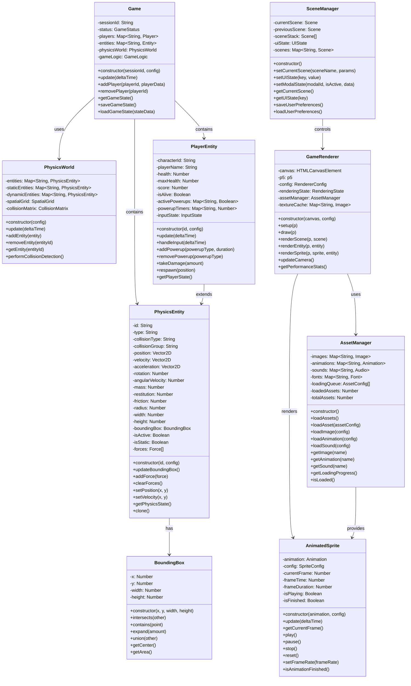

### Database and API Classes

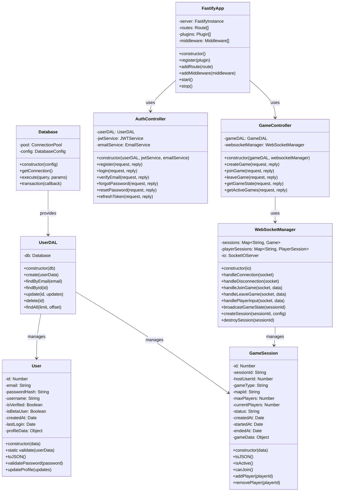

### Client-Side Architecture

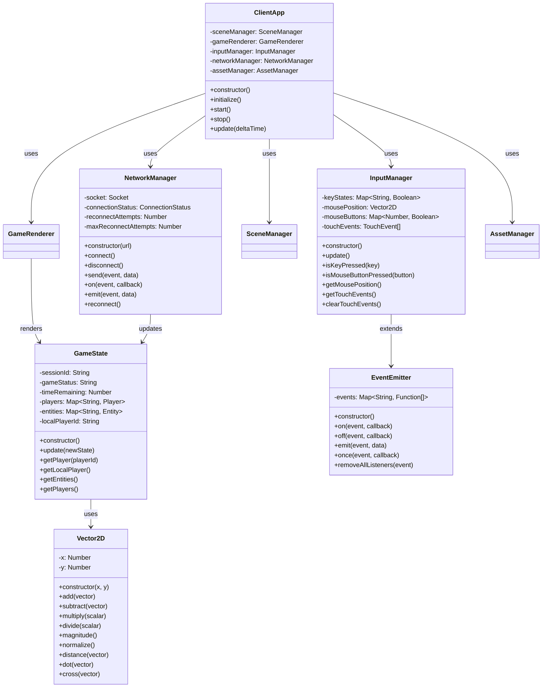

## Sequence Diagrams

### Player Joining Game Session

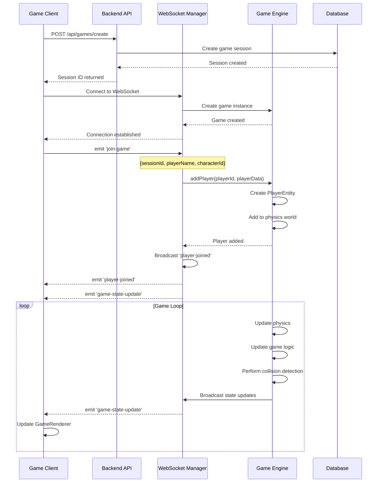

### Real-time Game State Synchronization

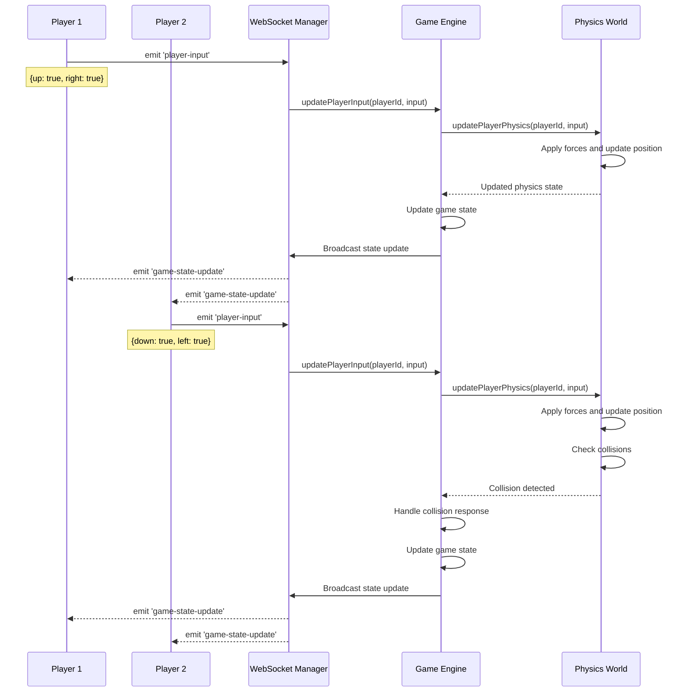

### Asset Loading Process

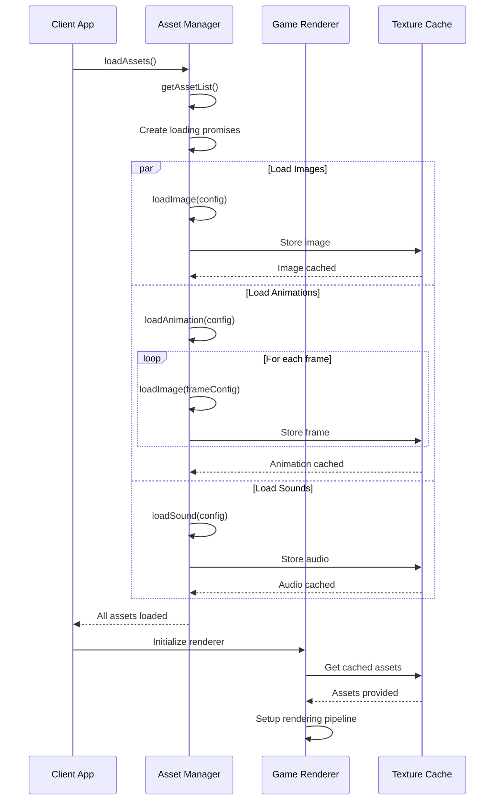

### Authentication Flow

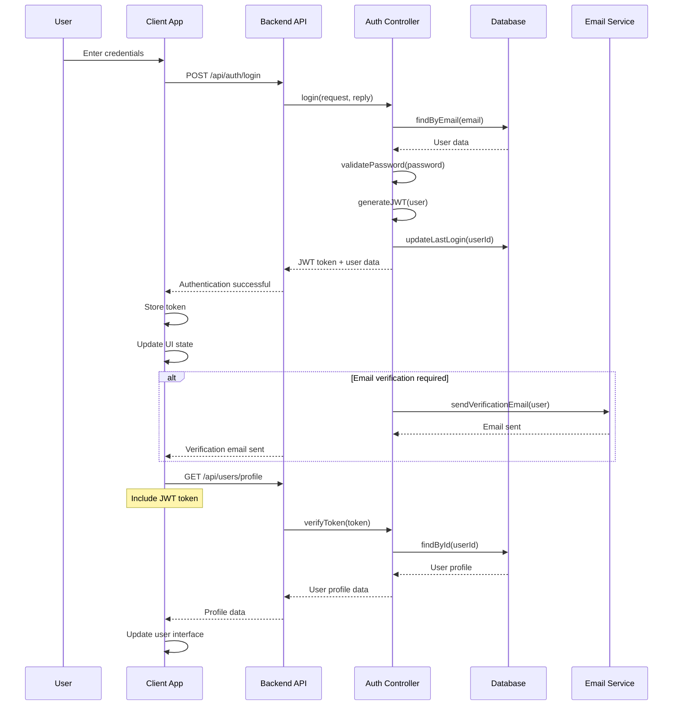

## Architecture Diagrams

### System Architecture Overview

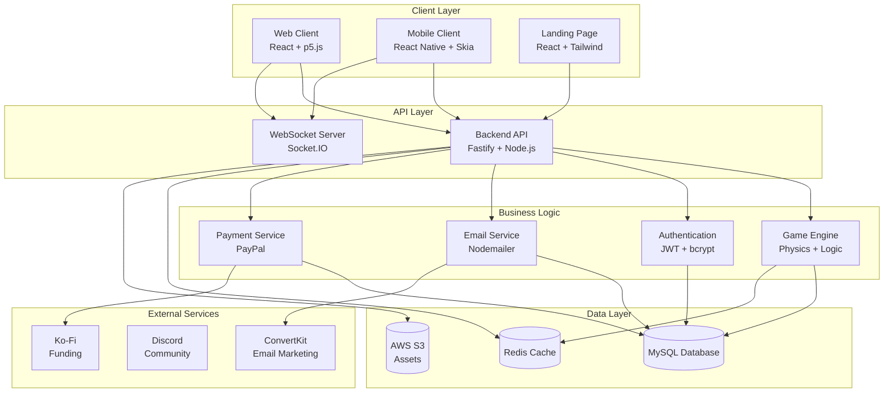

### Monorepo Structure

```mermaid
graph TD
    subgraph "Root"
        Root[package.json<br/>pnpm-workspace.yaml]
    end

    subgraph "Applications"
        Server[apps/server<br/>Backend API]
        WebClient[apps/web-client<br/>Game Client]
        MobileClient[apps/mobile-client<br/>Mobile App]
        LandingPage[apps/landing-page<br/>Landing Page]
    end

    subgraph "Shared Packages"
        ClientLogic[packages/client-logic<br/>Game Logic]
        Database[packages/database<br/>Database Layer]
        Mailer[packages/mailer<br/>Email Service]
        Payment[packages/payment<br/>Payment Service]
        Redis[packages/redis<br/>Cache Service]
    end

    Root --> Server
    Root --> WebClient
    Root --> MobileClient
    Root --> LandingPage

    WebClient --> ClientLogic
    MobileClient --> ClientLogic
    Server --> Database
    Server --> Mailer
    Server --> Payment
    Server --> Redis
```

### Data Flow Architecture

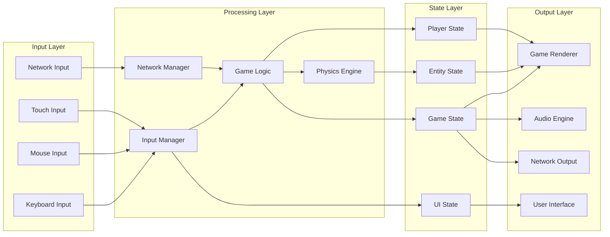

### Deployment Architecture

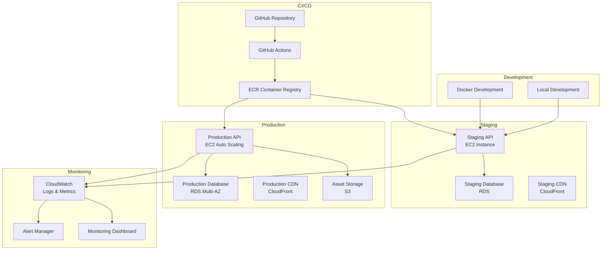

## Component Diagrams

### Game Engine Components

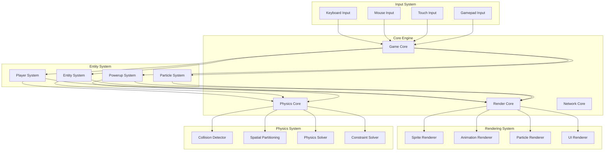

These UML diagrams provide a comprehensive view of the Bumper Vehicles system architecture, helping developers understand the relationships between components, data flow, and system interactions.
