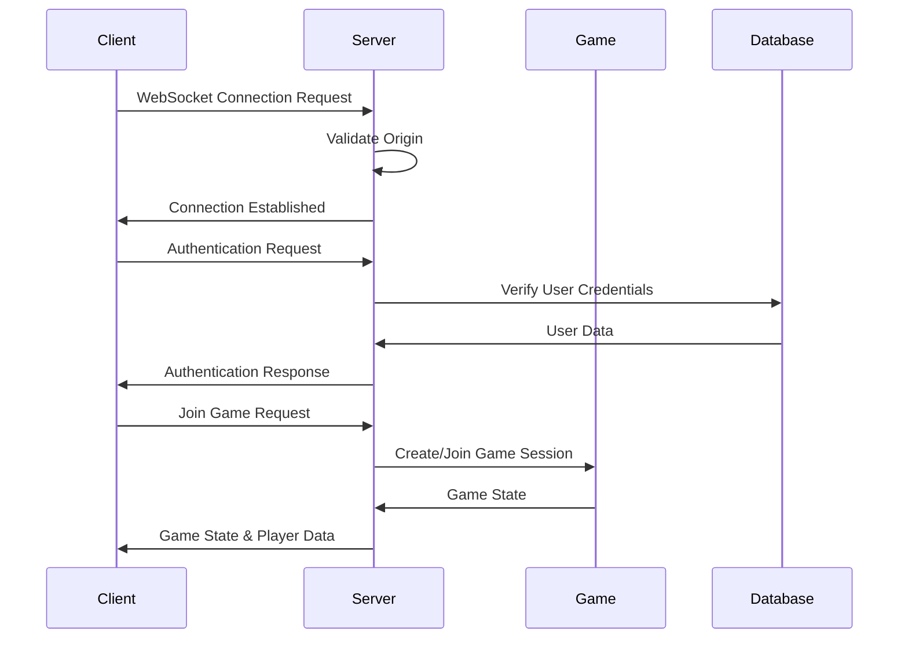
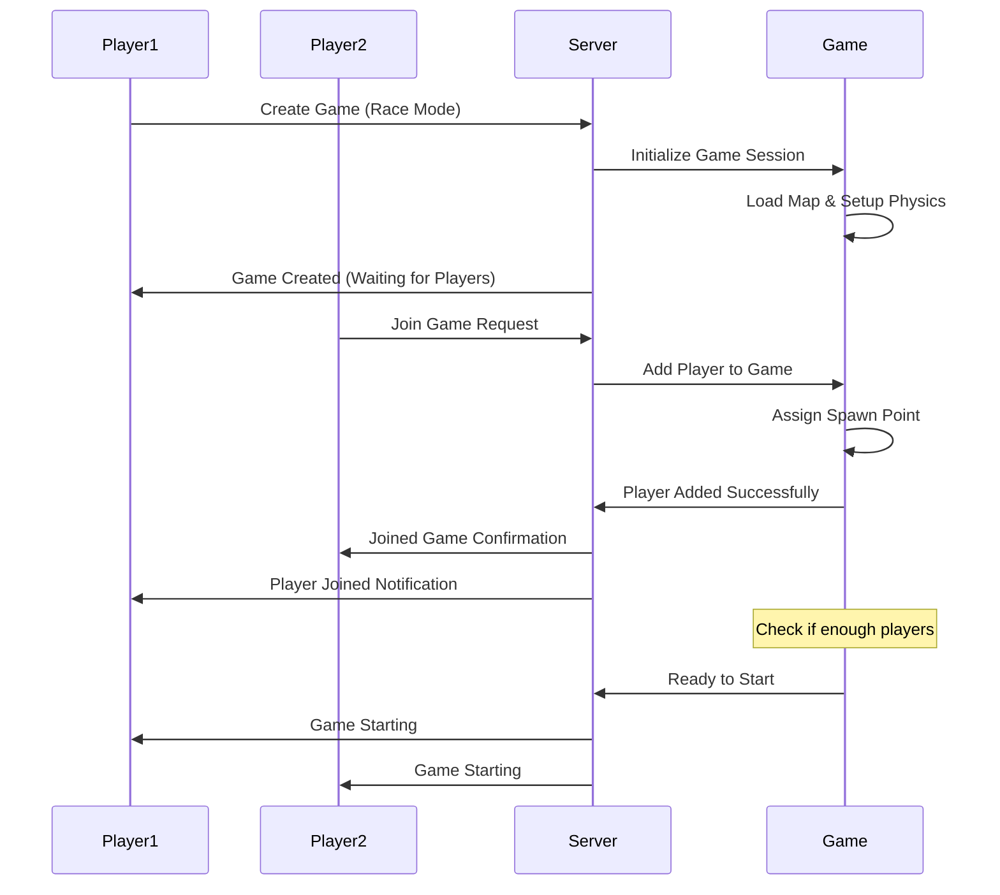
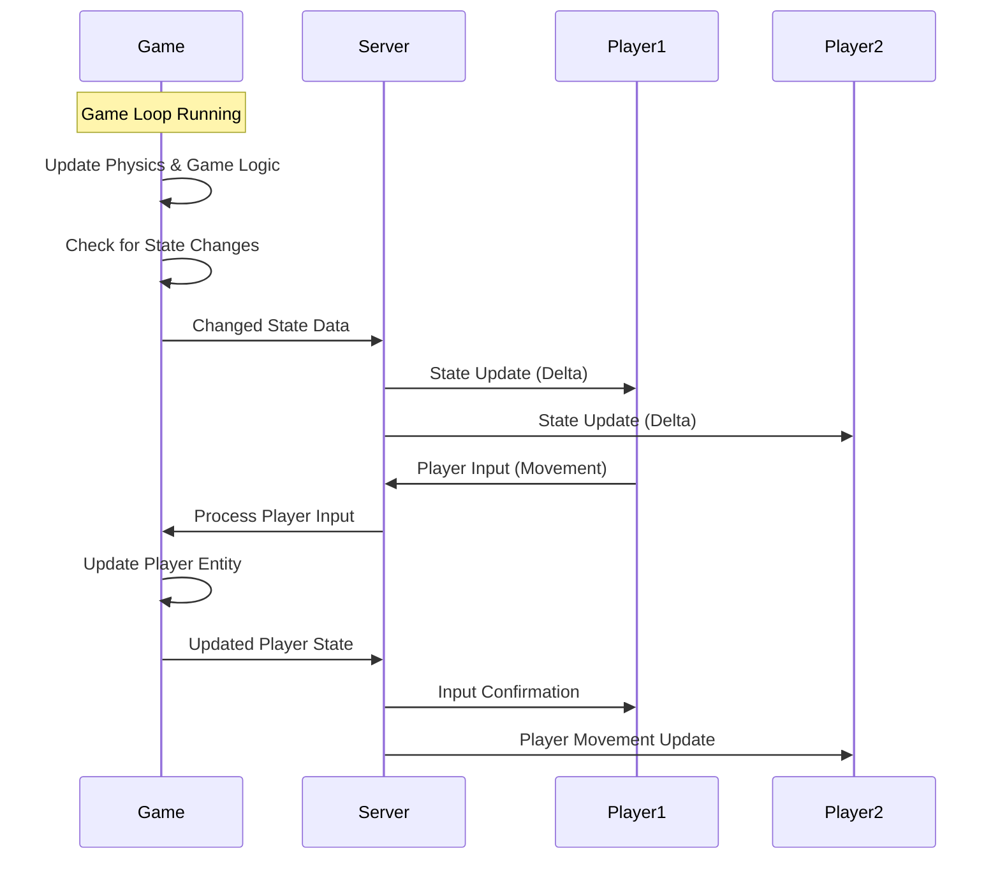
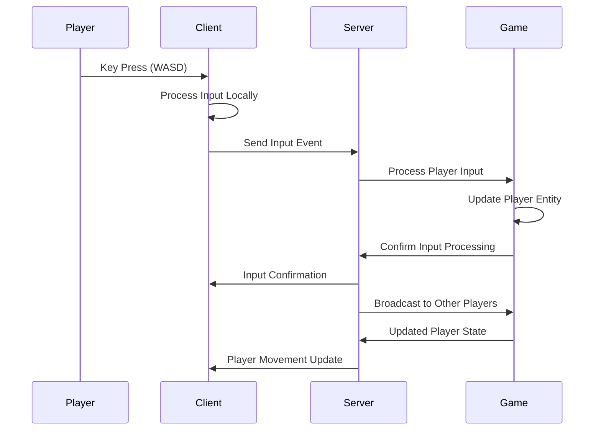
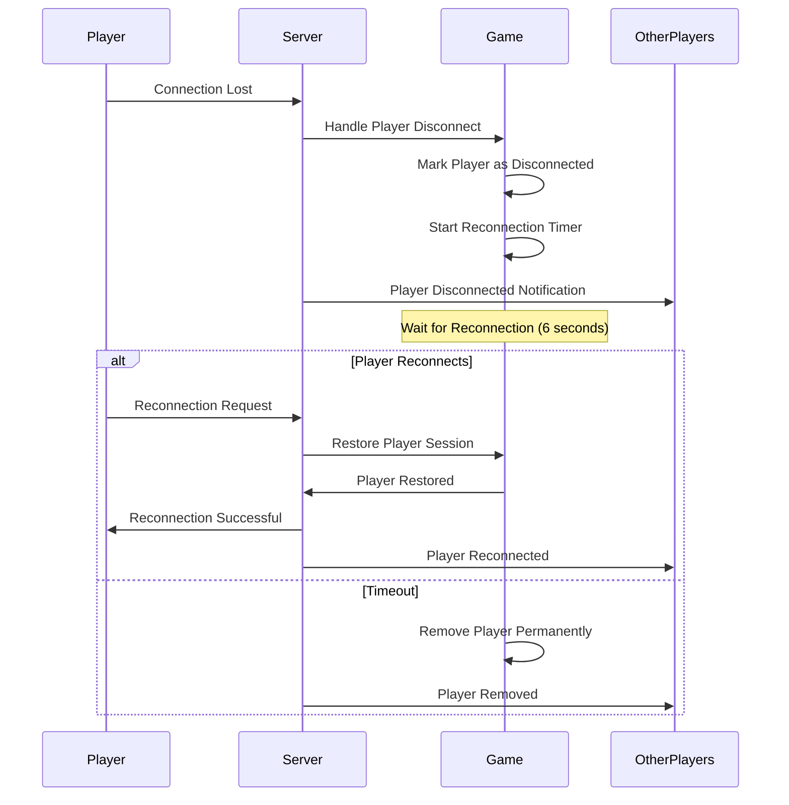
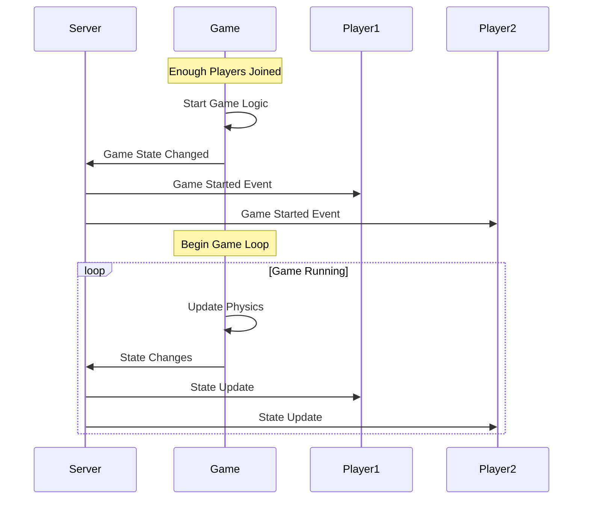
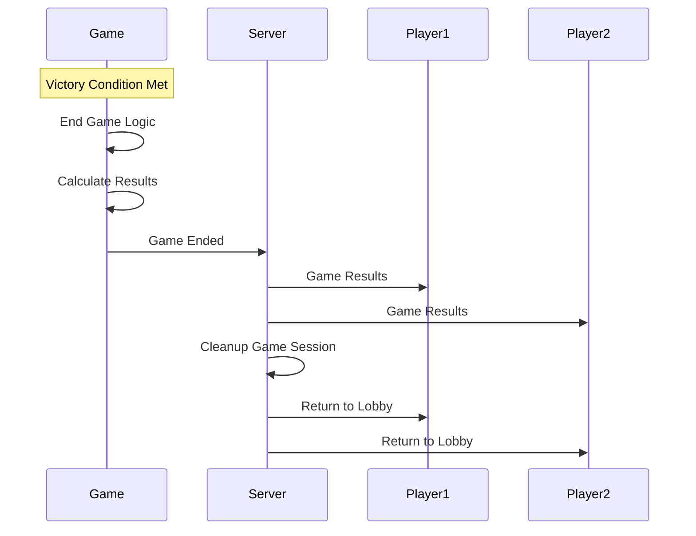

# WebSocket Communication 🔄

This document provides a comprehensive overview of the WebSocket communication system in Bumper Vehicles, including connection management, real-time game state synchronization, and sequence diagrams for key game events.

## 🏗️ Architecture Overview

The WebSocket system provides **real-time bidirectional communication** between the game server and clients, enabling:

- **Instant Game Updates** - Real-time state synchronization
- **Player Input** - Immediate response to player actions
- **Connection Management** - Robust handling of connections/disconnections
- **Room Management** - Game session isolation

## 🔌 Connection Management

### WebSocket Manager (`apps/server/src/game/websocket-manager.js`)

The WebSocket manager handles all real-time communication:

```javascript
class WebSocketManager {
  constructor(server) {
    this.io = new Server(server, {
      cors: {
        origin: allowedOrigins,
        methods: ["GET", "POST"],
      },
    });
    this.games = new Map();
  }

  initialize() {
    this.setupEventHandlers();
    this.startGameLoop();
  }
}
```

### Connection Flow



## 🎮 Game Session Management

### Game Creation Process



### Player Joining Sequence

```javascript
// Client requests to join game
socket.emit("joinGame", {
  gameId: "game_123",
  playerData: {
    id: "player_456",
    username: "Player1",
    character: "penguin",
  },
});

// Server processes join request
socket.on("joinGame", async data => {
  const game = games.get(data.gameId);
  if (game && game.state === "waiting") {
    const player = await game.addPlayer(socket, data.playerData, data.playerId);

    // Notify all players in game
    io.to(data.gameId).emit("playerJoined", {
      playerId: player.id,
      playerData: player.data,
    });

    // Send initial game state to new player
    socket.emit("gameState", game.getInitialState());
  }
});
```

## 🔄 Real-time State Synchronization

### State Update Flow



### State Synchronization Code

```javascript
// Server game loop
setInterval(() => {
  games.forEach(game => {
    // Update game physics
    game.update(io);

    // Send state changes to all players
    const changedState = game.getChangedActorsState();
    const newActors = game.getNewActorsState();
    const removedActors = game.getRemovedActorsIds();

    if (
      changedState.length > 0 ||
      newActors.length > 0 ||
      removedActors.length > 0
    ) {
      io.to(game.id).emit("stateChanges", {
        changed: changedState,
        new: newActors,
        removed: removedActors,
      });
    }
  });
}, 1000 / 60); // 60 FPS
```

### Client State Processing

```javascript
// Client receives state updates
socket.on("stateChanges", data => {
  // Process changed actors
  data.changed.forEach(actorState => {
    const actor = gameRenderer.getActor(actorState.id);
    if (actor) {
      actor.update(actorState);
    }
  });

  // Process new actors
  data.new.forEach(actorState => {
    gameRenderer.createActor(actorState);
  });

  // Process removed actors
  data.removed.forEach(actorId => {
    gameRenderer.removeActor(actorId);
  });
});
```

## 🎯 Player Input Handling

### Input Flow



### Input Processing Code

```javascript
// Client sends input
keyManager.onKeyPress("KeyW", () => {
  socket.emit("playerInput", {
    type: "movement",
    direction: "up",
    timestamp: Date.now(),
  });
});

// Server processes input
socket.on("playerInput", input => {
  const game = getPlayerGame(socket.id);
  const player = game.getPlayerBySocketId(socket.id);

  if (player && game.state === "playing") {
    // Process input and update player
    player.processInput(input);

    // Confirm input processing
    socket.emit("inputProcessed", {
      inputId: input.id,
      timestamp: input.timestamp,
    });

    // Broadcast to other players
    socket.to(game.id).emit("playerInput", {
      playerId: player.id,
      input: input,
    });
  }
});
```

## 🔌 Connection Lifecycle

### Player Disconnection



### Reconnection Handling

```javascript
// Server handles disconnection
socket.on("disconnect", () => {
  const game = getPlayerGame(socket.id);
  if (game) {
    const player = game.getPlayerBySocketId(socket.id);
    if (player) {
      // Mark player as disconnected
      game.handleDisconnect(socket.id, io);

      // Start reconnection timer
      setTimeout(() => {
        if (!player.isReconnected) {
          game.removePlayer(socket.id);
          io.to(game.id).emit("playerRemoved", {
            playerId: player.id,
          });
        }
      }, 6000); // 6 second timeout
    }
  }
});

// Player reconnection
socket.on("reconnect", data => {
  const game = games.get(data.gameId);
  const player = game.getPlayerByPlayerId(data.playerId);

  if (player && !player.isReconnected) {
    game.handleReconnect(socket.id, data.playerId);
    socket.emit("reconnectionSuccessful", {
      gameState: game.getState(),
    });
  }
});
```

## 🎮 Game Events

### Game Start Event



### Game End Event



## 📊 Performance Optimization

### Message Optimization

```javascript
// Optimize message size
const optimizeState = state => {
  return {
    // Only send essential data
    players: state.players.map(player => ({
      id: player.id,
      pos: player.position,
      vel: player.velocity,
      rot: player.rotation,
    })),
    entities: state.entities.map(entity => ({
      id: entity.id,
      type: entity.type,
      pos: entity.position,
      size: entity.size,
    })),
  };
};

// Compress messages
const compressMessage = message => {
  return JSON.stringify(message);
};
```

### Bandwidth Management

```javascript
// Throttle updates based on network conditions
class UpdateThrottler {
  constructor() {
    this.lastUpdate = 0;
    this.updateInterval = 16; // ~60 FPS
  }

  shouldUpdate() {
    const now = Date.now();
    if (now - this.lastUpdate >= this.updateInterval) {
      this.lastUpdate = now;
      return true;
    }
    return false;
  }
}
```

## 🔒 Security & Validation

### Input Validation

```javascript
// Validate player input
const validateInput = input => {
  const validInputs = ["movement", "action", "powerup"];
  const validDirections = ["up", "down", "left", "right"];

  if (!validInputs.includes(input.type)) {
    return false;
  }

  if (input.type === "movement" && !validDirections.includes(input.direction)) {
    return false;
  }

  return true;
};
```

### Rate Limiting

```javascript
// Rate limit player inputs
const rateLimit = new Map();

const checkRateLimit = (playerId, inputType) => {
  const key = `${playerId}_${inputType}`;
  const now = Date.now();
  const lastInput = rateLimit.get(key) || 0;

  if (now - lastInput < 50) {
    // 50ms minimum between inputs
    return false;
  }

  rateLimit.set(key, now);
  return true;
};
```

## 🐛 Error Handling

### Connection Errors

```javascript
// Handle connection errors
socket.on("connect_error", error => {
  console.error("Connection error:", error);
  showReconnectingOverlay();
});

socket.on("reconnect", attemptNumber => {
  console.log("Reconnected after", attemptNumber, "attempts");
  hideReconnectingOverlay();
});

socket.on("reconnect_failed", () => {
  console.error("Failed to reconnect");
  showConnectionError();
});
```

### Game State Recovery

```javascript
// Recover from state inconsistencies
socket.on("stateError", error => {
  console.error("State error:", error);

  // Request full state update
  socket.emit("requestFullState");
});

socket.on("fullState", state => {
  // Reset client state and apply full state
  gameRenderer.resetState();
  gameRenderer.applyFullState(state);
});
```

## 📈 Monitoring & Analytics

### Connection Metrics

```javascript
// Track connection metrics
const connectionMetrics = {
  activeConnections: 0,
  totalGames: 0,
  averageLatency: 0,
  messageCount: 0,
};

// Update metrics
socket.on("connect", () => {
  connectionMetrics.activeConnections++;
});

socket.on("disconnect", () => {
  connectionMetrics.activeConnections--;
});
```

### Performance Monitoring

```javascript
// Monitor WebSocket performance
const performanceMetrics = {
  messageLatency: [],
  updateFrequency: 0,
  bandwidthUsage: 0,
};

// Track message latency
const trackLatency = messageId => {
  const startTime = Date.now();
  return response => {
    const latency = Date.now() - startTime;
    performanceMetrics.messageLatency.push(latency);
  };
};
```

---

_The WebSocket communication system provides robust real-time multiplayer functionality with efficient state synchronization, connection management, and error handling._
